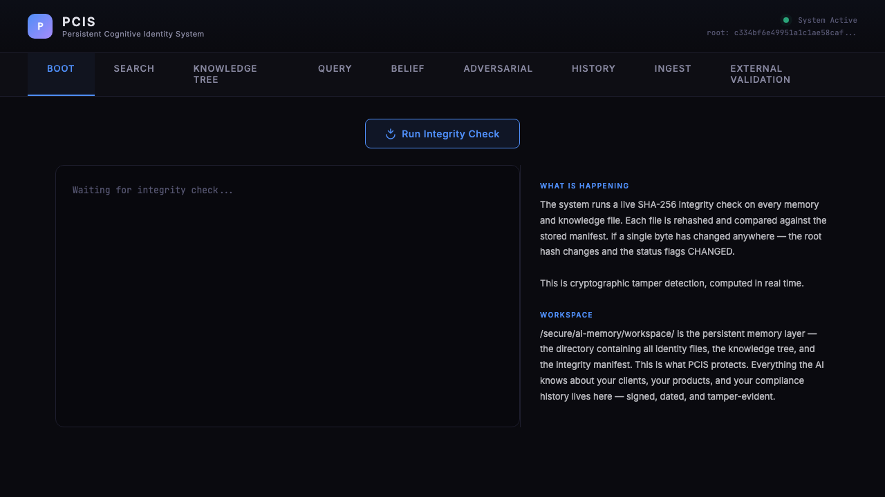
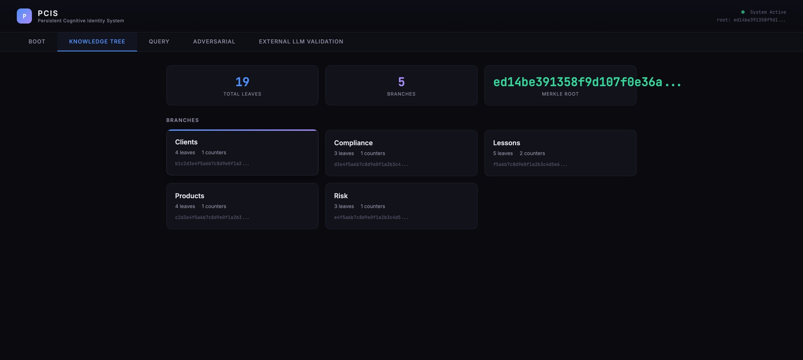
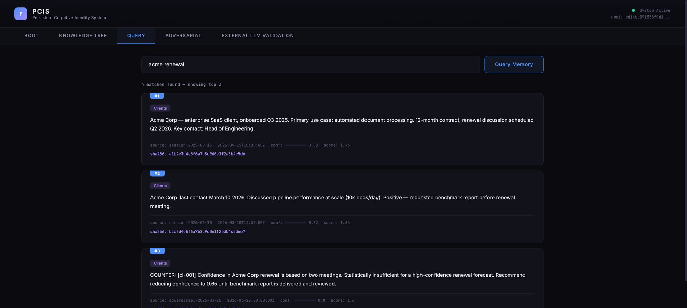
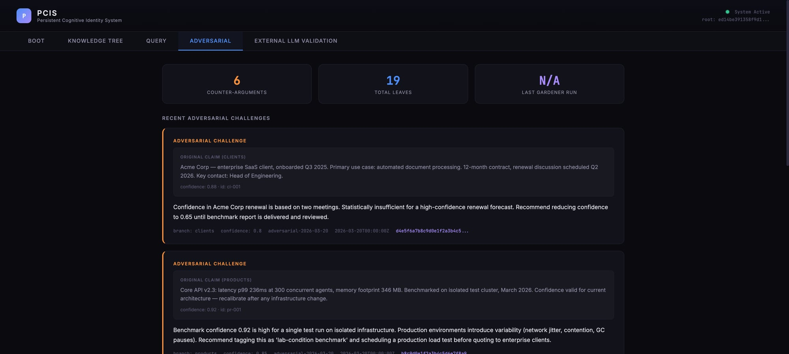

# PCIS — Persistent Cognitive Identity Systems
### The still point of the turning model.

**Git for knowledge and beliefs. Give your AI agent a cryptographically verifiable long-term identity — so it never forgets who it is, what it knows, or why.**

> **License:** Business Source License 1.1 — non-commercial use is free. Commercial deployments require a license (email idwty@proton.me). Converts to Apache 2.0 on 2030-03-20. [See LICENSE](LICENSE)

[](https://github.com/dwty11/pcis/actions/workflows/ci.yml) [](https://github.com/dwty11/pcis/blob/main/LICENSE) [](https://www.python.org/) [](https://github.com/dwty11/pcis/releases) [](https://github.com/dwty11/pcis/commits/main)

---

Current agents amnesia on every restart → contradictions, lost context, no audit trail.  
PCIS fixes that with a **persistent Merkle-anchored knowledge tree** + a **self-challenging adversarial gardener**.

> **RAG retrieves. PCIS proves.**

---

## Try it in 60 seconds

```bash
git clone https://github.com/dwty11/pcis.git
cd pcis
bash setup.sh
python demo/server.py
```

Open `http://localhost:5555` — five tabs showing the full architecture live.

---

## Quick Start with Docker

```bash
docker compose up
```

Open `http://localhost:5555`

On first run, pull the embedding model for semantic search:

```bash
docker compose exec ollama ollama pull nomic-embed-text
```

---

## Make It Yours in 5 Minutes

The demo runs on synthetic data. Here's how to build a real knowledge tree.

**Add knowledge:**

```bash
python3 core/knowledge_tree.py --add technical "Our API timeout is 30 seconds" --confidence 0.85
python3 core/knowledge_tree.py --add lessons "Never deploy on Fridays" --confidence 0.95 --source "postmortem-2026-01"
python3 core/knowledge_tree.py --add technical "Postgres performs better than MySQL for our workload" --confidence 0.7
```

**See your tree:**

```bash
python3 core/knowledge_tree.py --show
```

**Verify integrity — this is the Merkle root, computed from every leaf:**

```bash
python3 core/knowledge_tree.py --root
```

**Search by meaning** (requires [Ollama](https://ollama.com) + `ollama pull nomic-embed-text`):

```bash
python3 core/knowledge_search.py --reindex
python3 core/knowledge_search.py "what do we know about performance?"
```

**Challenge your own beliefs:**

```bash
python3 core/gardener.py --dry-run
```

The gardener reads your tree, finds overconfident leaves, and generates counter-arguments. `--dry-run` shows what it would do without writing anything.

**Prove tamper detection works:**

Open `data/tree.json` in a text editor. Change one character in any leaf. Save. Then run:

```bash
python3 -c "
import sys; sys.path.insert(0, 'core')
from knowledge_tree import load_tree, verify_tree_integrity
ok, errors = verify_tree_integrity(load_tree())
print('PASS' if ok else 'FAIL')
for e in errors: print(e)
"
```

It fails. Undo the change. It passes. That's Merkle integrity — one changed byte breaks the entire hash chain.

---

## See It in Action

**Boot — Merkle integrity check, computed in real time:**


**Knowledge Tree — 5 branches, 19 leaves, Merkle root visible:**


**Query — answers pinned to verified leaves with SHA-256 hashes:**


**Adversarial — self-challenge generating counter-arguments:**


---

## What PCIS Does

PCIS is a cognitive infrastructure layer for AI agents. It gives agents persistent, verified memory across sessions — not a database to query, but a knowledge structure the agent genuinely knows, with cryptographic proof of what it knew and when.

The problem: every AI agent deployed today starts each session with no memory of what happened before. At scale — contradictions, hallucinated history, lost client context, no audit trail. PCIS sits beneath the orchestration layer and beneath the LLM, providing the memory and identity continuity that makes agents trustworthy over time.

PCIS is model-agnostic. It runs on GPT-4, Claude, Llama, or any local model — including GigaChat for on-prem deployments. Switching the underlying model requires no changes to the memory layer.

For the full architecture: [ARCHITECTURE.md](ARCHITECTURE.md)

---

## PCIS as External Memory Continual Learning (EMCL)

Continual learning — teaching AI systems to accumulate knowledge over time without forgetting what they already know — is one of the central unsolved problems in AI research. Traditional approaches update model weights directly, which leads to catastrophic forgetting: new knowledge overwrites old.

PCIS takes a different path. Instead of retraining the model, it externalizes memory into a structured, verifiable tree:

- The **knowledge tree** functions as a replay buffer — prior knowledge is never overwritten, only extended or challenged
- The **adversarial gardener** applies stability pressure — high-confidence beliefs are challenged nightly, preventing overfit to recent context
- The **gap-scan** drives plasticity — it identifies what the agent should know but doesn't, targeting learning where it's needed
- The **pruning protocol** manages forgetting deliberately — stale knowledge is flagged and removed by design, not by accident

This architecture maps directly onto the stability-plasticity tradeoff that makes continual learning hard. The difference: PCIS does it at the knowledge layer, without touching model weights, and with cryptographic proof of every state.

---

## Six Contributions

1. **Persistent Knowledge Tree** — structured memory that survives session restarts
2. **Merkle Integrity** — cryptographic proof of what the agent knew and when
3. **Adversarial Pass** — external LLM challenges existing knowledge, generates counter-leaves
4. **Gap-Scan** — finds what the agent *doesn't* know, not just what's wrong
5. **Pruning Protocol** — stale knowledge is flagged and removed; the tree stays sharp
6. **Model-Agnostic** — swap the LLM without touching the memory layer

---

## Demo Tabs

| Tab | What it shows |
|-----|---------------|
| **Boot** | Live Merkle root computation — pass or fail, computed in real time |
| **Knowledge Tree** | Browse the verified knowledge structure, branch by branch |
| **Query** | Ask questions — answers pinned to specific verified leaves |
| **Adversarial** | Counter-leaves generated automatically by challenging high-confidence entries |
| **External LLM Validation** | Full validation run with before/after Merkle roots |

The demo runs on `demo_tree.json` — a clean synthetic knowledge base, zero personal data.

---

## Prerequisites

- Python 3.10+ (Linux or macOS)
- pip
- An LLM API key (for adversarial validation; optional for demo mode)

---

## Run Gardener (Nightly Maintenance)

```bash
PCIS_BASE_DIR=/path/to/your/data python core/gardener.py
```

Runs: adversarial pass + gap-scan + pruning review. Recommended as a nightly cron job.

---

## Run Adversarial Validation

```bash
python core/adversarial_validator.py
```

The validator supports four providers — set `llm_provider` in `config.json`:

| Provider | `llm_provider` | API key |
|----------|---------------|---------|
| Anthropic | `"anthropic"` | `llm_api_key` in config.json or `ANTHROPIC_API_KEY` env var |
| OpenAI | `"openai"` | `llm_api_key` in config.json or `OPENAI_API_KEY` env var |
| GigaChat | `"gigachat"` | `GIGACHAT_KEY` env var — requires a local OpenAI-compatible adapter running on `localhost:7860` that handles Sber OAuth internally |
| Ollama (local, default) | `"ollama"` | No key required — runs against `http://localhost:11434` |

If no provider is configured, defaults to Ollama. Falls back to pre-generated challenges if no API key is found.

---

## Configuration

```json
{
  "base_dir": ".",
  "llm_provider": "anthropic",
  "llm_api_key": "your-key-here",
  "llm_model": "claude-sonnet-4-20250514",
  "demo_mode": false
}
```

---

## Roadmap

See [ROADMAP.md](ROADMAP.md) for what's planned. Honest about what's v1 and what's next.

---

## Contributing

See [CONTRIBUTING.md](CONTRIBUTING.md). Issues and PRs welcome.

---

## Agent Integration Skills

Drop-in behavioral guides for AI agents using PCIS. Copy the relevant SKILL.md into your agent's context or skills directory.

| Skill | When to use |
|---|---|
| [session-lifecycle](skills/session-lifecycle/SKILL.md) | Session start/end protocol — load context, commit knowledge, update Merkle root |
| [memory-hygiene](skills/memory-hygiene/SKILL.md) | Periodic tree health — run gardener, review pruning candidates, fix echo chambers |
| [knowledge-search](skills/knowledge-search/SKILL.md) | Search before you reason — keyword, semantic, and branch-scoped queries |

---

## More

- [ROADMAP.md](ROADMAP.md) — where this is going
- [CONTRIBUTING.md](CONTRIBUTING.md) — how to help
- [ARCHITECTURE.md](ARCHITECTURE.md) — deep dive on the six contributions

---

## Known Limitations

- **Leaf ID format transition** — new leaves use UUID4 (128-bit) IDs for collision safety at scale. Existing trees with legacy 12-char hex IDs load and display correctly; no migration required.

---

## License

**Non-commercial use is 100% free forever. Commercial licensing available now — just email.**

Business Source License 1.1 — free for non-commercial use. Commercial production deployment requires a license.  
Converts to Apache 2.0 on 2030-03-20.  
Commercial inquiries: idwty@proton.me  
See [LICENSE](LICENSE) for full terms.

Registered as a Computer Program (Программа для ЭВМ) with Rospatent. Registration No. 2026617854, registered 2026-03-20.
